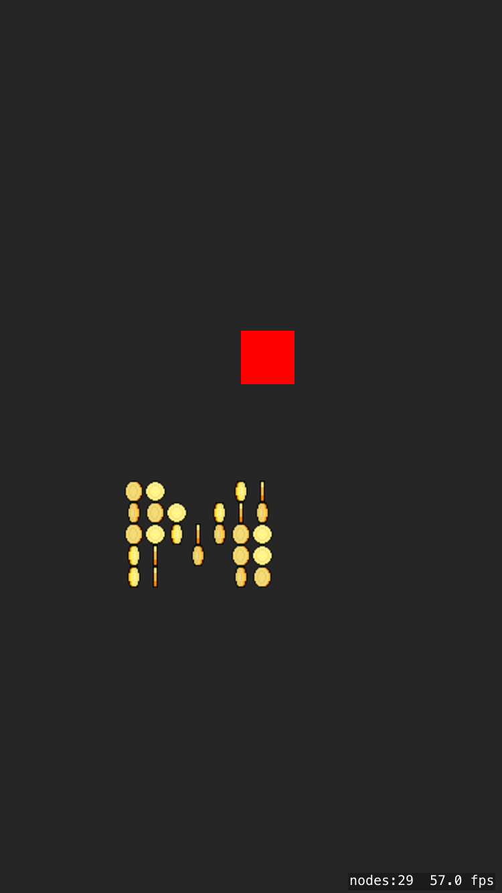

# Coin-Generator

This example shows a simple system for creating blocks of animated coins similar to what you might see in games like 
[Jetpack Joyride](http://halfbrick.com/our-games/jetpack-joyride/) and others. You could use the ideas here to display 
other game objects in any grid formation. 

The system declares an array of nested arrays containing 1 and 0. A one places a coin, while a 0 marks an empty spot. 
You may notice the y postion of coins is reversed! This is needed to make the arrays visually match the display on the 
screen, remember SpriteKit defines the lower left corner as x 0 and y 0!

Coins are animated using SKAction.

